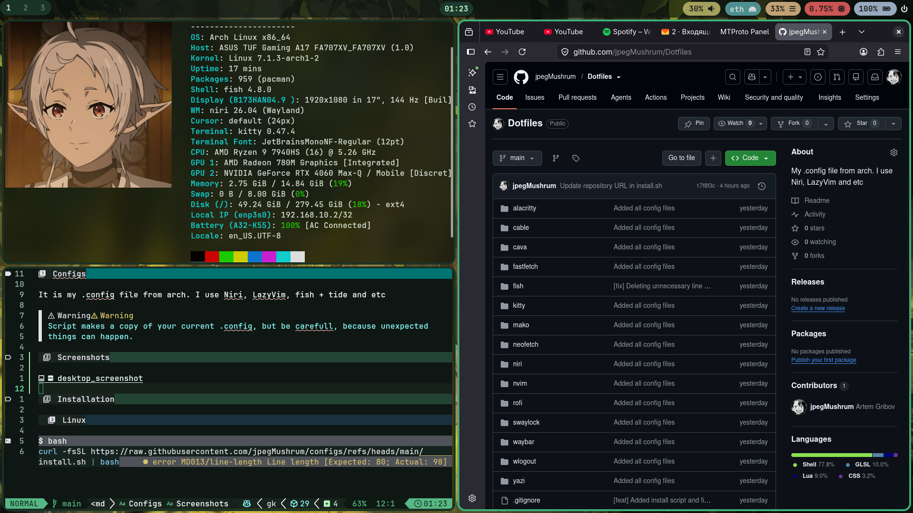

# Dotfiles

It is my .config files from Arch. 
I use Niri, LazyVim, fish + tide and etc.
I don't use quick shell, I don't know what happen if this config being applied to a system with running quick shell.

> [!WARNING]
> Script makes a copy of your current .config, but be carefull, because unexpected
> things can happen.

## Screenshots



## Installation

### Linux

**This script doesn't install anything, it only moves files from this repo to your .config**

```bash
curl -fsSL https://raw.githubusercontent.com/jpegMushrum/configs/refs/heads/main/install.sh | bash
```
